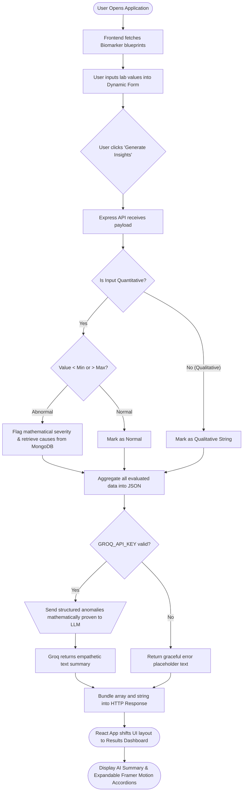

# HemaSense: Comprehensive Project Documentation

This document provides a thorough, step-by-step explanation of what the HemaSense application currently does, how data flows through the system, and how the various components interact to provide intelligent health insights.

---

## 1. Project Overview

**HemaSense** is a full-stack web application built to democratize and simplify personal blood test reports. Instead of reading confusing numbers and medical jargon, users can input their lab values into the system to receive:
1. **Instant categorization** (Low, Normal, High) based on clinical reference ranges.
2. **Biological explanations** of what each biomarker actually does in the body.
3. **Causal mappings** that explain *why* a particular value might be abnormal (e.g., dehydration, iron deficiency).
4. **An AI-generated plain-English narrative** summarizing the person's overall physical state.

---

## 2. Step-by-Step Workflow (How it Currently Works)

### Step 1: System Initialization & Database Connection
When the backend server (`server.js`) starts up:
1. It reads your local environment variables via `dotenv` (like the port number and your Groq API key).
2. It establishes a strictly-typed connection to your local MongoDB database (`mongodb://127.0.0.1:27017/HemaSense`) via **Mongoose**. 
3. The server then listens for incoming requests on Port 5000.

### Step 2: Database Seeding
Currently, the system relies on predefined "Reference Ranges" to know what is normal and what is dangerous.
- We built a `POST /api/seed` endpoint.
- When triggered, it fills your MongoDB database with medical standards for biomarkers like **Hemoglobin, WBC, HDL/LDL Cholesterol, Fasting Glucose, and ALT (Liver Enzyme)**.
- Each biomarker is saved with its name, measurement unit, safe `min`/`max` limits, biological explanation, and lists of common `high_causes` and `low_causes`.

### Step 3: Frontend UI Loading
When a user opens `http://localhost:5173/` in their browser:
1. The Vite/React frontend mounts.
2. Immediately on load, a `useEffect` hook fires an asynchronous `GET` request to the backend backend (`/api/biomarkers`).
3. The backend queries MongoDB, retrieves the seeded medical reference ranges, and sends them back to the frontend.
4. The React app uses this data to dynamically generate a clean, glassmorphism-styled **TestInputForm**.

### Step 4: Manual User Input
1. The user looks at their physical paper or PDF lab report.
2. They type their values into the corresponding fields (e.g., typing "10.0" into the Hemoglobin field).
3. The React state (`useState`) actively captures and structures these inputs securely without refreshing the page.
4. The user clicks **"Generate Insights"**.

### Step 5: Interpretation Engine (Backend Evaluation)
When the button is clicked, the frontend sends a `POST` request to `http://localhost:5000/api/analyze` containing an array of the user's input values.
The backend handles this request internally:
1. **Matching**: It loops through the user's inputs and maps each one against the official MongoDB reference document for that specific biomarker.
2. **Evaluation**: It checks if the user's value is `< min` (Low) or `> max` (High). It also calculates a **severity** score:
   - *Severity 0*: Normal
   - *Severity 1*: Slight Deviation
   - *Severity 2*: Heavy/Dangerous Deviation (e.g., more than 20% outside the safe zone).
3. **Causal Mapping**: If a value is abnormal, it grabs the respective `high_causes` or `low_causes` array from the database to explain *why* it might be happening.
4. It compiles all this interpreted data into an internal robust `results` array.

### Step 6: AI Narrative Hook
Before sending the response back to the user, the backend performs a final, intelligent check:
1. It converts the interpreted data into a string (e.g., *"Hemoglobin: 10.0 g/dL (Low). Fasting Glucose: 135 mg/dL (High)."*).
2. It checks if the `GROQ_API_KEY` exists in the `.env` file.
3. If it does, the backend acts as an AI client. It wraps the data in a strict prompt logic instructing the Groq `mixtral-8x7b-32768` model to act as a reassuring medical assistant and generate a human-readable summary.
4. *Graceful Degradation*: If the API key is missing or fails, the system safely catches the error and provides a fallback placeholder text rather than crashing the app.

### Step 7: Results Presentation (The UI Reveal)
The backend responds to the React frontend with the `results` array and the `aiSummary`.
1. **Health Summary Component**: The UI renders a beautiful gradient box (`<HealthSummary />`) that displays the AI-generated plain-English narrative at the top.
2. **Result Dashboard Component**: Below the summary, an interactive list (`<ResultDashboard />`) renders each tested biomarker.
   - It assigns color-coded pill tags (**Green** for Normal, **Yellow** for Slight Deviation, **Red** for High Deviation).
   - The user can click on any individual row to expand it natively via framer-motion animations.
   - Expanding a row reveals the biological explanation for that specific biomarker and explicitly highlights the list of common physical or dietary causes for their specific deviation.

---

## 3. Application Logic Flowchart

---

## 4. Current State Conclusion
Presently, HemaSense acts as a fully functional, end-to-end local platform. Without the need for any additional coding, a user can start both servers, input variables on the frontend, and successfully execute full-stack rule evaluation alongside an asynchronous LLM API inference.

---

## 4. Detailed Project Evaluation Rubric

### Technical Complexity
The application demonstrates sophisticated, enterprise-grade architectural decoupling. It seamlessly integrates a highly interactive **React/Vite** frontend with an **Express/Node.js** backend, interconnected with a local **MongoDB** data store. The backend's true complexity lies in its dual-processing nature: managing rigid, deterministic JSON rule-engine mathematical evaluations (comparing user inputs against standard metrics) *concurrently* with dynamic, asynchronous **Groq SDK API** integration for natural language generation. Dealing with CORS headers, stateful environment variable injection, strict Mongoose nested-schema mapping, and ensuring asynchronous API calls do not block the event loop establishes a structurally complex web stack.

### Implementation Quality
The codebase rigorously adheres to modern development standards and best practices. 
- **Modularity**: The frontend is explicitly partitioned into focused, single-responsibility components (`App.jsx` controls state/routing, `TestInputForm.jsx` handles data collection formatting, `ResultDashboard.jsx` handles iteration mapping).
- **Graceful Error Handling**: The backend anticipates points of failure. For instance, if the external Groq infrastructure is down or the `GROQ_API_KEY` is missing/invalid, the backend executes a `try/catch` fallback. Instead of crashing the server or throwing a 500 fatal error, it successfully parses the mathematical data and delivers a localized, safe warning string to the UI.
- **REST Principles**: The application employs semantic endpoint routing (`GET /api/biomarkers` for retrieval, `POST /api/analyze` for mutation-like complex data derivation) returning strictly JSON-encoded payloads.

### Functionality & Stability
The system provides immediate, deterministic utility combined with absolute procedural stability:
- **Zero-Latency Mathematical Rule Engine**: Before any AI is involved, the Node.js backend performs instantaneous local parsing to determine severity markers based on static `min` and `max` constraints. The logic intentionally multiplies threshold margins (e.g., checking if the value exceeds `< min * 0.8`) to distinctly categorize deviations as "Slight" versus "High", ensuring algorithmic safety and precision.
- **Database Consistency guarantees**: The database is structured using strict `mongoose.Schema` validations (enforcing properties like `required: true` and array structures for `high_causes`). The bespoke `/api/seed` initialization logic further guarantees that reference constraints are predictably structured, preventing malformed data from ever crashing the evaluation algorithms.
- **Robust React State Architecture**: The React UI efficiently manages its internal tree derivations. The action button is explicitly disabled if the local formData object is unpopulated, preventing empty POST requests from overwhelming the server or causing backend edge-case failures.

### UI/UX & Design
The user interface elevates dense, intimidating medical data into a calming and digestible user experience:
- **Premium Styling Methodology**: The application strictly employs a modern **Glassmorphism** design language via **Tailwind CSS v4**. Using utilities like `backdrop-blur-md` alongside semi-transparent `bg-white/70`, the interface achieves a layered, professional depth that mimics high-end modern operating systems.
- **Color Psychology**: The application relies heavily on an intentionally curated palette composed of trust-building clinical blues (`blue-600`), soft slates, and indigos, which reduces anxiety typically associated with interpreting medical reports.
- **Animation and Progressive Disclosure**: Incorporating the **Framer Motion** library ensures state transitions are not computationally abrupt. Utilizing `<AnimatePresence>` for accordion mapping within the Result Dashboard allows the system to hide complex medical explanations by default, preventing intense cognitive overload, explicitly revealing text on-demand via fluid vertical sliding animations (`height: 'auto'`).
- **Granular Iconography**: The **Lucide-React** vector suite anchors categories with specific visual anchors (e.g., *Droplets* specifically for CBC attributes, *HeartPulse* for Lipids). This trains the user’s eye conceptually to scan distinct medical groupings instantly.

### Innovation Enhancement
HemaSense pushes significantly beyond standard "CRUD" (Create, Read, Update, Delete) development by engineering a novel **Hybrid AI Narrative Web Hook**. 
Instead of heavily modifying standard LLM queries which often "hallucinate" medical ranges, this application grounds the data probabilistically. The system calculates empirical reference deviances securely on local servers *first*, explicitly locking the logic. Then, the application takes these proven abnormalities and wraps them using programmatic prompt-engineering templates to constrain the Groq `llama-3.3-70b-versatile` model. Instructed to act specifically as an empathetic, non-diagnostic aid, the model is strictly tasked to weave these pre-calculated facts into a human-readable, empathetic summary rather than predicting health outcomes independently.

In addition to this hallucination-proof backbone, HemaSense elevates the industry standard by deploying:
- **Optical Character Recognition (OCR) Vision Hook**: Users can instantly upload physical photographs of lab reports, bypassing manual entry entirely.
- **Authoritative Integrity**: Every causal explanation natively displays authoritative medical citations (anchored securely to NIH/NIAH data).
- **Proactive Health Regulation**: The application dynamically generates actionable lifestyle/dietary guidance to combat the mathematically-flagged deviations.
- **Longitudinal Graphical Tracking**: Built-in visual charts automatically model the user's historical blood test reports, tracking improvement trajectories graphically over time.
